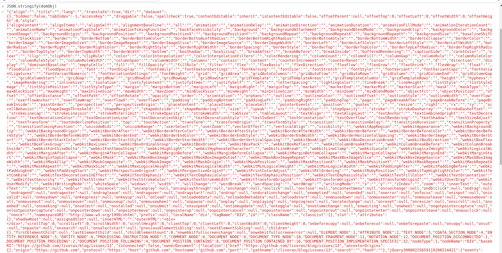

# 虚拟DOM及Diff算法的实现

使用React也有一年左右的时间了，记得刚开始接触时，不止一次地惊叹它高效的渲染机制，但对其原理着实困扰了好久，今天我就站在一个初学者的角度，使用原生js语法实现一个我心目中的 react。

## 使用说明

写到这儿的时候，我其实还没有着手代码的编写，甚至还没有一个较为清晰的构思。但是我想把使用的方法写在前面，可以当成我编码的一种制约或者规范。

*** code ***

```javascript
/**
 * 渲染效果
 * <div class="root">
 *    <div class="header">
 *    this is header
 *    </div>
 *    container
 *    <div class="footer">
 *    this is footer
 *    </div>
 * </div>
 *
 */
 const Footer = VirtualDom.createElement(
  'div',
  {
    className: 'root'
  },
  'this is footer'
);

const Header = VirtualDom.createElement(
  'div',
  {
    className: 'root'
  },
  'this is header'
);

const Root = VirtualDom.createElement(
  'div',
  {
    className: 'root'
  },
  [Header,'this is Ctx', Footer]
);

VirtualDom.renderDOM(Root, document.getElementById('app'));
```

## 虚拟DOM

原生DOM元素，是非常庞大的，每一个DOM元素会为我们提供很多的属性和方法，但通常情况下，我们关心的只是其中很小的一部分。但在以往的思路中，我们每一次都是操作真实DOM元素，哪怕很小的一个变动，都可能引起整棵DOM树的重排，这对我们的性能是非常大的损失。

为了减少DOM的操作，以及不必要的重排和重绘，React引入了虚拟DOM，值得注意的是，虚拟DOM并不是React首创，关于他的出处，本文不做过多的研究。

### 什么是虚拟DOM

我自己的理解是，通过简单的对象来表示一个复杂的DOM节点或者DOM树的方法。

比如对一个普通的div，HTML的表示方式如下。
```html
<div class="parent" id="container" style="background-color: #000">This is a div</div>
```

通过JavaScript对象的表示方式如下
```json
{
  "type": "div",
  "props": {
    "class": "parent",
    "id": "container",
    "style": {
      "background-color": "#000"
    }
  },
  "children": "This is a div"
}
```
我们对DOM的所有操作，可以通过操作上面这个JavaScript对象来完成。如果直接操作真实的DOM，你将会和下边这个对象打交道。

```JavaScript
var domObj = {};
var dom = document.createElement("div")
for(var item in dom) {
  domObj[item] = dom[item]
}
JSON.stringify(domObj)
```



与简单js对象相比，原生DOM无疑庞大得多。

### 虚拟DOM的实现

有了对虚拟DOM的构想，实现起来也就很简单了。

***生成虚拟DOM***

我们给VirtualDom对象提供createElement方法，用于生成虚拟DOM对象，下文中用`element`代替。

该方法的原型如下
```javascript
element createElement(
  type: string,
  props: object,
  children: Array<element|string>|element|string
)
```

createElement 接受三个参数

- type：
  代表element的类型，或者tagName
- props：
  代表element的属性
- children：
  代表element的子节点

代码实现如下

```javascript
function Element (type, props, children) {
  return {
    type: type,
    props: props,
    children: children
  }
}

VirtualDom.createElement = function (targetName, props, children) {
  var childArray = [];
  var childrenLength = arguments.length - 2;
  if (childrenLength === 1) {
    handler.isArray(children) ? childArray = children: childArray.push(children);
  } else if (childrenLength > 1) {
    for(var i = 0; i < childrenLength; i++) {
      childArray[i] = arguments[i + 2];
    }
  }
  return Element(targetName, props, childArray);
};
```

所以我们可以过createElement方法创建DOM树
```javascript
const Footer = VirtualDom.createElement(
 'div',
 {
   className: 'root'
 },
 'this is footer'
);
```

***渲染DOM***

为VirtualDom提供renderDOM方法，将虚拟DOM渲染至浏览器平台。函数的原型很简单，这里就不赘述了。

```javascript
VirtualDom.renderDOM = function (element, selector) {
  var _render = function (ele) {
    if(!ele) return;
    var _ele = document.createElement(ele.type); //生成DOM
    var props = ele.props || {};
    var children = ele.children || [];
    Object.keys(props).forEach(function(item) {
      _ele.setAttribute(item, props[item]) //设置属性
    });
    var _child;
    children.forEach(function(child) {
      _child = handler.isString(child) ? document.createTextNode(child) :
        _render(child); // 递归生成子节点
      _ele.appendChild(_child);
    });
    return _ele;
  }
  selector.appendChild(_render(element));
  return element;
};
```
